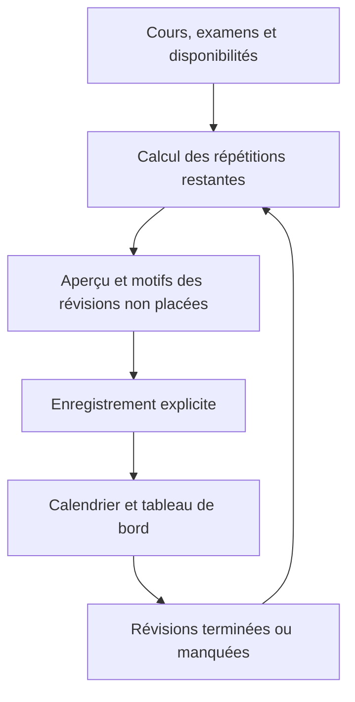

# Study Planner

Study Planner est une application web en français pour organiser ses révisions à partir de ses cours, de ses examens et de ses disponibilités.

Pour chaque séance de cours, elle calcule une charge de révision, la répartit en répétitions espacées et propose des créneaux de travail. Le planning peut être recalculé lorsque les disponibilités, les cours ou les examens changent, tout en conservant les révisions terminées.

Le projet comprend actuellement la planification, l’enregistrement, le calendrier visuel, le suivi des révisions et les statistiques. Ce guide décrit cette version ; la configuration d’un hébergement public reste une étape distincte.

## Sommaire

- [Fonctionnalités](#fonctionnalités)
- [Technologies](#technologies)
- [Installation](#installation)
- [Configuration Supabase](#configuration-supabase)
- [Utilisation](#utilisation)
- [Fonctionnement du planning](#fonctionnement-du-planning)
- [Architecture](#architecture)
- [Commandes et tests](#commandes-et-tests)
- [Sécurité](#sécurité)
- [Test sur téléphone](#test-sur-téléphone)
- [Déploiement sur Vercel](#déploiement-sur-vercel)
- [Dépannage](#dépannage)
- [Limites et évolutions](#limites-et-évolutions)
- [Documentation technique](#documentation-technique)

## Fonctionnalités

| Domaine | Fonctionnement actuel |
| --- | --- |
| Compte | Inscription, confirmation par courriel, renvoi du lien, connexion et déconnexion. |
| Guide de démarrage | Explications pas à pas, progression vérifiée sur les données enregistrées, pause et reprise jusqu’au premier planning. |
| Matières | Création, modification, coefficient de révision et archivage avec conservation du suivi. |
| Horaires de cours | Plusieurs horaires hebdomadaires par matière, avec une période de début et de fin propre à chaque matière. |
| Examens | Dates, heures et importance prises en compte dans la planification. |
| Disponibilités | Créneaux hebdomadaires pendant lesquels l’utilisateur souhaite travailler. |
| Répétitions | Intervalles configurables, initialement à J+1, J+3, J+7 et J+14. |
| Planification | Aperçu, pauses entre révisions, priorités et explications des révisions non placées. |
| Replanification | Remplacement des propositions dans la période choisie, déduction du travail terminé et conservation des séances hors de cette période. |
| Calendrier | Agenda quotidien sur mobile, grille hebdomadaire sur ordinateur, vue mois et détail des cours, examens et révisions enregistrées. |
| Suivi | Validation des révisions terminées, signalement des séances manquées et rattrapage lors d’un recalcul. |
| Statistiques | Temps terminé et planifié, progression par matière et suivi des six dernières semaines. |
| Isolation | Authentification et politiques RLS pour séparer les données de chaque compte. |

## Technologies

| Élément | Technologie |
| --- | --- |
| Application | Next.js 16, App Router et React 19 |
| Langage | TypeScript |
| Styles | Tailwind CSS 4 et CSS |
| Interface | Composants locaux suivant shadcn/ui, panneaux Radix UI et icônes Lucide |
| Données | PostgreSQL via Supabase |
| Authentification | Supabase Auth avec `@supabase/ssr` |
| Tests applicatifs | Exécuteur de tests intégré à Node.js |
| Tests de base de données | Scripts SQL sur une base PostgreSQL de test |

Les versions exactes sont déclarées dans [package.json](package.json) et verrouillées dans [package-lock.json](package-lock.json). Le calendrier est implémenté dans le projet, sans bibliothèque de calendrier externe.

## Installation

### Prérequis

- Node.js et npm. Node.js 24 permet de reproduire l’environnement utilisé pour les vérifications ; la version de Next.js installée exige au minimum Node.js 20.9.
- Git pour récupérer le dépôt.
- Un projet Supabase et l’accès à son SQL Editor pour installer le schéma.

### 1. Récupérer le projet

```bash
git clone https://github.com/steveyambo/study_planner.git
cd study_planner
npm ci
```

Toutes les commandes suivantes s’exécutent dans le dossier contenant `package.json`. Dans l’espace de travail de développement d’origine, il s’agit du sous-dossier `study-planner`.

### 2. Configurer les variables d’environnement

Si `.env.local` n’existe pas encore, copier le modèle :

```powershell
# Windows / PowerShell
Copy-Item .env.example .env.local
```

```bash
# macOS / Linux
cp .env.example .env.local
```

Renseigner les valeurs du projet Supabase :

```dotenv
NEXT_PUBLIC_SUPABASE_URL=https://VOTRE-PROJET.supabase.co
NEXT_PUBLIC_SUPABASE_PUBLISHABLE_KEY=VOTRE_CLE_PUBLIQUE
```

| Variable | Obligatoire | Rôle |
| --- | --- | --- |
| `NEXT_PUBLIC_SUPABASE_URL` | Oui | URL du projet Supabase. |
| `NEXT_PUBLIC_SUPABASE_PUBLISHABLE_KEY` | Oui | Clé publique du projet, utilisée par les clients Supabase. |
| `APP_PUBLIC_ORIGIN` | Non | Origine publique explicite pour les redirections et les formulaires lorsque l’application fonctionne derrière un tunnel ou un proxy. |

La clé publique identifie l’application ; les sessions utilisateur et les politiques RLS contrôlent l’accès aux données. Une ancienne clé `anon` peut également être utilisée dans cette variable. Ne jamais y mettre une clé secrète ou `service_role`. Voir les [types de clés Supabase](https://supabase.com/docs/guides/getting-started/api-keys).

`APP_PUBLIC_ORIGIN` doit contenir uniquement une origine HTTP ou HTTPS, par exemple `https://mon-site.example`, sans chemin, paramètres ni identifiants. Elle n’est pas nécessaire pour le fonctionnement local habituel.

`.env.local` est ignoré par Git. Seul le modèle vide `.env.example` doit être versionné. Redémarrer le serveur après une modification des variables.

### 3. Installer le schéma Supabase

Appliquer les migrations et configurer l’authentification comme expliqué dans la section suivante avant de créer un compte.

### 4. Démarrer l’application

```bash
npm run dev
```

Ouvrir [http://localhost:3000](http://localhost:3000).

Sous PowerShell, si la politique d’exécution bloque `npm.ps1` ou `npx.ps1`, utiliser `npm.cmd` et `npx.cmd` pour les mêmes commandes.

## Configuration Supabase

### Migrations

Dans le SQL Editor du projet Supabase, exécuter les fichiers suivants **une seule fois, dans cet ordre** :

| Ordre | Fichier | Apport |
| --- | --- | --- |
| 1 | [202610020001_initial_schema.sql](supabase/migrations/202610020001_initial_schema.sql) | Tables initiales, politiques RLS et création du profil lors d’une inscription. |
| 2 | [202610030001_save_schedule.sql](supabase/migrations/202610030001_save_schedule.sql) | Première fonction d’enregistrement du planning. |
| 3 | [202610030002_replanning.sql](supabase/migrations/202610030002_replanning.sql) | Replanification, archivage, snapshots et contrôle de version du planning. |
| 4 | [202610030003_clean_schedule_history.sql](supabase/migrations/202610030003_clean_schedule_history.sql) | Conservation des origines de cours et nettoyage des propositions remplacées. |
| 5 | [202610030004_complete_study_session.sql](supabase/migrations/202610030004_complete_study_session.sql) | Validation d’une révision terminée. |
| 6 | [202610030005_course_periods.sql](supabase/migrations/202610030005_course_periods.sql) | Dates de début et de fin propres à chaque matière. |
| 7 | [202610030006_missed_sessions.sql](supabase/migrations/202610030006_missed_sessions.sql) | Signalement des séances manquées et prise en charge d’un plafond quotidien. |
| 8 | [202610030007_optional_daily_limit.sql](supabase/migrations/202610030007_optional_daily_limit.sql) | Plafond quotidien facultatif, désactivé par défaut. |

Les migrations ne sont pas toutes réexécutables : sur un projet déjà configuré, appliquer uniquement celles qui manquent. Elles utilisent des transactions ; une erreur doit être corrigée avant de passer au fichier suivant. L’application ne les applique pas automatiquement à la base distante. La version actuelle attend le schéma jusqu’à la migration `007`.

### Tables principales

| Table | Contenu |
| --- | --- |
| `profiles` | Profil, fuseau horaire, préférences et versions du planning. |
| `courses` | Matières, coefficient de révision, périodes et archivage. |
| `course_sessions` | Horaires hebdomadaires des cours. |
| `exams` | Examens associés aux matières. |
| `availabilities` | Disponibilités hebdomadaires de l’utilisateur. |
| `revision_rules` | Intervalles de répétition du compte. |
| `study_sessions` | Révisions planifiées, terminées, manquées ou annulées. |
| `course_occurrences` | Origines datées des séances de cours, conservées pour le suivi et le rattrapage. |

L’inscription crée le profil et les règles initiales de répétition. Les jours de semaine suivent la convention ISO : `1` pour lundi, jusqu’à `7` pour dimanche. Le fuseau initial du profil est `America/New_York` ; les dates et les validations utilisent le fuseau du profil.

### Authentification et confirmation par courriel

Dans **Authentication → URL Configuration**, configurer :

- **Site URL** pour le développement : `http://localhost:3000`.
- Une URL de redirection autorisée : `http://localhost:3000/auth/callback`.
- Pour un hébergement ou un tunnel, ajouter son URL exacte suivie de `/auth/callback`. En production, définir également la Site URL publique.

Supabase vérifie les destinations de redirection par rapport à cette configuration. Voir la [documentation des URL de redirection](https://supabase.com/docs/guides/auth/redirect-urls).

Lorsqu’une confirmation est nécessaire, ouvrir le lien dans **le même navigateur que celui utilisé pour l’inscription ou le renvoi du lien** : le flux PKCE s’appuie sur l’état conservé dans ce navigateur. Après confirmation, se connecter au compte.

Le guide [Configuration Supabase](docs/supabase-setup.md) et le guide [Authentification](docs/authentication.md) détaillent cette installation.

## Utilisation

### Créer son premier planning

À la première connexion, le tableau de bord propose **Commencer le guide**. Le parcours `/getting-started` explique le principe, puis accompagne la création des matières, leurs horaires, les disponibilités, les examens facultatifs et le premier planning. Les étapes déjà renseignées sont reconnues automatiquement. Les réglages de répétition peuvent garder leurs valeurs initiales.

Un rappel accompagne les pages de configuration tant que le guide est actif. **Plus tard** permet de le quitter ; **Guide de démarrage**, dans le menu (sur téléphone : **Plus**), permet de le retrouver. Les préférences du guide sont conservées dans ce navigateur, séparément pour chaque compte. Les cours, disponibilités et le planning restent dans Supabase : leur progression est reconnue aussi sur un autre appareil. Aucune migration supplémentaire n’est nécessaire. Voir [le guide et ses vérifications](docs/guided-setup.md).

1. Créer un compte, confirmer l’adresse si nécessaire et se connecter.
2. Dans **Mes cours**, ajouter les matières, leur coefficient de révision et, si nécessaire, leurs dates de début et de fin.
3. Ajouter les horaires hebdomadaires de chaque matière.
4. Dans **Examens**, renseigner les dates, les heures et l’importance des examens si elles sont connues. Cette étape est facultative.
5. Dans **Disponibilités**, indiquer les créneaux pendant lesquels on souhaite réviser.
6. Dans **Paramètres**, adapter les intervalles de répétition.
7. Dans **Planification**, choisir les périodes, la pause et l’option de rattrapage.
8. Cliquer sur **Calculer l’aperçu**, puis examiner les séances proposées et les révisions non placées.
9. Enregistrer le planning pour retrouver les révisions dans le calendrier et le tableau de bord.

**L’aperçu seul ne crée pas de révisions enregistrées.**

### Comprendre les périodes

| Champ | Signification |
| --- | --- |
| Début des cours / Fin des cours à inclure | Période globale des séances de cours dont le contenu doit être révisé. |
| Dates propres à une matière | Réduisent cette période pour la matière concernée. |
| Début du planning | Première date possible pour les nouvelles révisions, à partir de demain dans le fuseau du profil. |
| Fin du planning | Dernière date à laquelle une révision peut être proposée. |

La fin d’un cours et la fin des révisions sont différentes. Par exemple, si l’anglais se termine le 15 décembre, ses derniers contenus peuvent encore être révisés après cette date, avant l’examen et dans la période du planning.

### Recalculer après un changement

Après l’ajout, la modification ou l’archivage d’un cours, ou après une modification des disponibilités, des examens ou des règles, recalculer l’aperçu puis enregistrer le résultat.

Le remplacement concerne les révisions encore planifiées dans la période choisie. Les révisions terminées sont conservées et déduites de la charge restante. Les séances conservées hors de cette période occupent toujours leur créneau. Les anciennes propositions remplacées sont supprimées pour éviter leur accumulation dans l’historique ; les séances terminées et manquées restent dans le suivi.

### Suivre les révisions

- **Terminée** : valider une révision réellement effectuée, à partir de son jour prévu. Son travail est pris en compte lors des recalculs.
- **Manquée** : une séance peut être signalée comme manquée une fois son heure de fin passée. Le rattrapage demande ensuite un nouvel aperçu et un enregistrement.
- **Révisions déjà échues** : l’option de rattrapage permet de considérer comme restant à faire des répétitions anciennes dont l’application ne connaît pas la réalisation. Les origines déjà suivies peuvent aussi avoir du travail restant ; décocher cette option ne supprime pas leur suivi.

L’application ne connaît pas les révisions effectuées en dehors d’elle. Les statistiques mesurent le planning enregistré et ses validations.

## Fonctionnement du planning

### Une charge de révision pour chaque séance de cours

```text
Charge de révision = durée de la séance de cours × coefficient de révision
```

Exemple : un cours de 3 heures avec un coefficient de 2 représente 6 heures de révision au total. Avec quatre répétitions, cela donne quatre séances de 1 h 30. La répartition conserve le total en minutes entières ; les éventuelles minutes restantes vont aux premières répétitions.

Chaque séance de cours possède ses propres répétitions. Le deuxième cours d’une matière crée donc une nouvelle série ; il ne remplace pas les répétitions du premier cours.

Avec les intervalles initiaux, les dates souhaitées sont :

| Contenu à revoir | Révision 1 | Révision 2 | Révision 3 | Révision 4 |
| --- | --- | --- | --- | --- |
| Cours A du 14 septembre 2026 | 15 septembre | 17 septembre | 21 septembre | 28 septembre |
| Cours A du 21 septembre 2026 | 22 septembre | 24 septembre | 28 septembre | 5 octobre |

Ce sont des dates souhaitées : les disponibilités, le rattrapage et les examens peuvent les déplacer. Une carte datée du **5 octobre** avec « contenu du cours du **21 septembre** » signifie qu’on travaille le 5 octobre sur le contenu appris le 21 septembre.

### Contraintes prises en compte

- Les horaires hebdomadaires génèrent des séances de cours dans les périodes autorisées.
- Les disponibilités qui se recouvrent sont réunies ; les cours, examens et révisions conservées retirent du temps disponible.
- Une répétition reste entière : elle doit tenir dans un créneau suffisamment long.
- Les répétitions d’une même séance de cours se suivent dans l’ordre, sur des jours distincts.
- Le moteur essaie de conserver les écarts configurés. Il peut les réduire lorsque nécessaire, avec au moins un jour entre deux répétitions.
- Une révision se place après la date du cours et avant l’examen concerné, dans la période du planning.
- Les pauses réservées entre révisions occupent du temps disponible sans augmenter le temps de travail affiché.
- Le travail terminé et les séances conservées sont pris en compte pour éviter les doublons.
- Une répétition impossible à placer apparaît avec une explication : manque de place, espacement, examen trop proche ou fin du planning.

Les disponibilités définissent déjà les heures de travail souhaitées. **Aucun plafond quotidien supplémentaire n’est imposé par défaut.** Une limite quotidienne peut être activée volontairement ; elle compte les minutes de révision de toutes les matières, sans les pauses ni les heures de cours.

Le moteur utilise des priorités liées notamment à la charge, à l’importance des examens et au temps restant. Son résultat est déterministe pour les mêmes données, mais il ne garantit pas un optimum global : lorsque les contraintes sont trop fortes, certaines révisions restent non placées.



## Architecture

```text
src/
├── app/                  Pages et routes HTTP avec l’App Router
├── components/           Formulaires, calendrier et interface de suivi
├── lib/
│   ├── calendar/         Événements et affichage du calendrier
│   ├── courses/          Logique des cours et de leurs horaires
│   ├── dashboard/        Suivi et statistiques
│   ├── exams/            Gestion des examens
│   ├── http/             Origine des requêtes et redirections
│   ├── onboarding/       Progression et reprise du guide de démarrage
│   ├── scheduler/        Calcul du planning et de ses contraintes
│   ├── supabase/         Clients Supabase et accès authentifié
│   └── utils/            Utilitaires partagés
├── types/                Types des données
└── proxy.ts              Protection des routes et actualisation de session
supabase/migrations/      Évolution du schéma et fonctions SQL
tests/                    Tests Node.js et SQL
docs/                     Guides fonctionnels et techniques
```

| Route | Page |
| --- | --- |
| `/` | Accueil |
| `/register` | Inscription |
| `/login` | Connexion |
| `/auth/callback` | Retour de confirmation Supabase |
| `/dashboard` | Révisions à suivre et statistiques |
| `/getting-started` | Guide de configuration pas à pas |
| `/courses` | Matières et horaires |
| `/exams` | Examens |
| `/availability` | Disponibilités |
| `/settings` | Paramètres de répétition |
| `/calendar` | Aperçu de planification et calendrier enregistré |

Les espaces applicatifs et le guide de démarrage nécessitent une session authentifiée. Les modifications utilisent des routes POST dédiées et des validations côté serveur.

## Commandes et tests

| Commande | Utilité |
| --- | --- |
| `npm run dev` | Serveur de développement avec rechargement automatique. |
| `npm run build` | Compilation de production. |
| `npm run start` | Serveur de production, après compilation. |
| `npm run lint` | Vérification ESLint. |
| `npx tsc --noEmit` | Vérification TypeScript sans génération de fichiers. |
| `node --test tests/*.test.mjs` | Ensemble des tests applicatifs. |

La compilation utilise `next/font` pour Geist et peut nécessiter un accès réseau pour récupérer les polices.

### Tests applicatifs

Les fichiers `*.test.mjs` couvrent le moteur de planification, les routes de sauvegarde, l’archivage, le suivi des séances, le calendrier, les statistiques et les protections des routes. Certains tests simulent Supabase ; ils ne remplacent pas les tests SQL des fonctions et des politiques de la base.

Il n’existe actuellement pas de script `npm test` : utiliser la commande Node.js indiquée ci-dessus.

### Tests SQL

Les scripts `tests/*.sql` sont destinés à une **base de test locale**, avec le schéma d’authentification de simulation et les migrations correspondant au scénario testé. Les anciens scénarios peuvent viser une étape antérieure du schéma ; ils ne constituent pas une suite à exécuter aveuglément sur le schéma final.

Le test d’isolation récent couvre le schéma jusqu’à `007` et termine sa transaction par `ROLLBACK`. **Ne pas exécuter ces fixtures dans le SQL Editor du projet Supabase réel.** La préparation de cette base locale n’est pas automatisée par les scripts npm. Voir [Sécurité](docs/security.md) et les prérequis en tête des fichiers SQL.

### Vérifications manuelles utiles

- Inscription, confirmation dans le même navigateur, connexion et déconnexion.
- Périodes différentes entre matières et révisions après la fin d’un cours.
- Absence de disponibilité, créneau trop court et examen proche.
- Ajout d’un cours ou d’une disponibilité après un premier enregistrement.
- Validation d’une révision puis recalcul sans perdre le travail terminé.
- Séance manquée puis rattrapage sans doublon.
- Navigation semaine/mois et détail des révisions courtes.
- Affichage sur téléphone, tablette et ordinateur.

## Sécurité

- Les huit tables applicatives disposent de politiques RLS pour isoler les comptes.
- L’identité est récupérée à partir des claims vérifiés par Supabase ; un propriétaire transmis par un formulaire ne fait pas autorité.
- Les routes POST contrôlent l’origine de la requête avant toute modification.
- Derrière un tunnel, `APP_PUBLIC_ORIGIN` donne l’origine autorisée ; les en-têtes `X-Forwarded-Host` et `X-Forwarded-Proto` ne peuvent pas la choisir.
- La sauvegarde recalcule le planning côté serveur et vérifie sa version. Les fonctions SQL contrôlent également les conflits et s’exécutent dans une transaction.
- Les fonctions de modification utilisent les droits de l’appelant et ne sont pas exécutables par les utilisateurs anonymes.
- Les réponses privées appliquent des règles de cache adaptées aux données authentifiées.
- Les secrets et le fichier `.env.local` restent hors du dépôt.

Les tests locaux vérifient le code et une base reconstruite avec les migrations. Ils ne confirment pas la configuration effective du projet Supabase distant ou de son hébergement. Le détail des protections et des vérifications figure dans [docs/security.md](docs/security.md).

## Test sur téléphone

Un tunnel ngrok permet de tester temporairement une version compilée depuis un téléphone. Il faut disposer de ngrok configuré et garder le PC ainsi que les deux processus actifs.

1. Compiler l’application :

   ```powershell
   npm.cmd run build
   ```

2. Dans un premier terminal, lancer le tunnel et relever son adresse HTTPS :

   ```powershell
   ngrok http http://127.0.0.1:3001 --inspect=false
   ```

3. Dans un second terminal, définir cette adresse pour le serveur puis le lancer :

   ```powershell
   $env:APP_PUBLIC_ORIGIN = 'https://ADRESSE-DU-TUNNEL.ngrok-free.app'
   npm.cmd run start -- --hostname 127.0.0.1 --port 3001
   ```

4. Ouvrir l’adresse HTTPS sur le téléphone et se connecter. Pour tester une inscription, autoriser aussi le callback exact du tunnel dans Supabase.
5. À la fin, arrêter les deux processus avec `Ctrl+C`, puis retirer la variable temporaire du terminal serveur :

   ```powershell
   Remove-Item Env:APP_PUBLIC_ORIGIN
   ```

L’inspection ngrok est désactivée pour éviter de conserver les formulaires de connexion dans son inspecteur local. Un changement d’adresse du tunnel demande de relancer le serveur avec la nouvelle origine. Le guide [Test sur téléphone](docs/mobile-testing.md) complète ces instructions.

## Déploiement sur Vercel

1. Appliquer les huit migrations au projet Supabase utilisé pour l’hébergement.
2. Importer le dépôt GitHub dans Vercel.
3. Vérifier le preset **Next.js** et le dossier racine contenant `package.json`. Dans ce dépôt Git, il s’agit de la racine ; ne pas ajouter un sous-dossier inexistant.
4. Ajouter `NEXT_PUBLIC_SUPABASE_URL` et `NEXT_PUBLIC_SUPABASE_PUBLISHABLE_KEY` pour les environnements concernés, puis déployer.
5. Définir la Site URL publique dans Supabase et autoriser `https://VOTRE-DOMAINE/auth/callback`.
6. Vérifier sur l’adresse publique la connexion, la confirmation d’inscription, le calcul et l’enregistrement d’un planning.

Lorsqu’un dépôt Git est connecté, Vercel peut redéployer automatiquement les nouveaux commits de sa branche de production configurée. Voir la [documentation de l’intégration Git Vercel](https://vercel.com/docs/git).

Ne pas réutiliser une adresse ngrok dans la configuration de production. Si `APP_PUBLIC_ORIGIN` est nécessaire, lui donner l’origine de l’environnement concerné : une origine de production fixée globalement ne convient pas aux URL différentes des déploiements Preview.

## Dépannage

| Problème | Vérification ou solution |
| --- | --- |
| Variables Supabase absentes | Vérifier `.env.local`, le dossier d’exécution et redémarrer le serveur. |
| Table, colonne ou fonction SQL introuvable | Vérifier l’ordre des migrations et appliquer celles qui manquent, jusqu’à `007`. |
| Confirmation par courriel refusée | Vérifier le callback autorisé, utiliser le lien le plus récent et le même navigateur que lors de l’inscription ou du renvoi. |
| Courriel non reçu | Vérifier les indésirables et les journaux Supabase Auth, puis la configuration et les limites du service de courriel utilisé. |
| Aperçu devenu obsolète | Des données ont changé depuis le calcul : recalculer l’aperçu avant d’enregistrer. |
| Certaines révisions restent non placées | Lire leur motif, adapter les disponibilités, prolonger le planning ou revoir les contraintes avant de recalculer. |
| Calendrier sans les révisions de l’aperçu | Enregistrer le planning puis vérifier la semaine ou le mois affiché. |
| Une révision mentionne un ancien cours | La date du cours identifie le contenu à revoir ; la date du calendrier indique le jour de travail. Le rattrapage peut déplacer ce travail. |
| Formulaire refusé derrière un tunnel | Définir `APP_PUBLIC_ORIGIN` avec l’adresse publique exacte et redémarrer le serveur. |
| Compilation bloquée sur les polices | Vérifier l’accès réseau nécessaire à `next/font`. |
| Commande npm bloquée sous PowerShell | Utiliser `npm.cmd` ou `npx.cmd`. |

## Limites et évolutions

### Limites actuelles

- Les périodes globales sont limitées à 366 jours inclus pour les cours et 91 jours inclus pour le planning.
- Les horaires restent dans une même journée ; une répétition n’est pas découpée entre plusieurs créneaux.
- Le recalcul et l’enregistrement sont explicites : aucune tâche en arrière-plan ne régénère automatiquement le planning.
- Après le premier enregistrement, un horaire ajouté ou modifié s’applique à partir de sa date d’effet ; les origines déjà connues conservent leur historique.
- Les statistiques portent sur les séances enregistrées. Elles excluent les révisions non placées et le travail réalisé hors de l’application, et ne mesurent pas la maîtrise du contenu.
- Les totaux hebdomadaires utilisent les dates prévues des séances, même si leur validation intervient plus tard.

### Évolutions possibles

Les notifications, l’export ou la synchronisation avec un calendrier externe, les quiz, les fiches de révision et l’installation comme application PWA sont des pistes d’évolution. Ces fonctionnalités ne sont pas encore implémentées.

## Documentation technique

| Sujet | Guides |
| --- | --- |
| Installation et compte | [Supabase](docs/supabase-setup.md), [Authentification](docs/authentication.md) |
| Cours | [Matières](docs/courses.md), [Horaires](docs/course-sessions.md), [Périodes par matière](docs/course-periods.md) |
| Contraintes | [Examens](docs/exams.md), [Disponibilités](docs/availability.md), [Priorité des examens](docs/exam-priority.md) |
| Répétitions | [Charge de travail](docs/study-time.md), [Répartition](docs/revision-distribution.md), [Règles](docs/revision-rules.md), [Dates souhaitées](docs/revision-dates.md) |
| Planning | [Calcul](docs/planning.md), [Enregistrement](docs/save-schedule.md), [Replanification](docs/replanning.md), [Nettoyage de l’historique](docs/clean-schedule-history.md) |
| Suivi | [Révisions terminées](docs/session-tracking.md), [Séances manquées](docs/missed-sessions.md), [Calendrier visuel](docs/visual-calendar.md), [Statistiques](docs/statistics.md) |
| Interface | [Navigation, composants et vérifications mobiles](docs/mobile-interface.md) |
| Exploitation | [Sécurité](docs/security.md), [Test sur téléphone](docs/mobile-testing.md) |

Certains guides retracent une étape antérieure du développement. Ce README décrit le fonctionnement actuel ; le code et les migrations correspondantes précisent les validations techniques.
